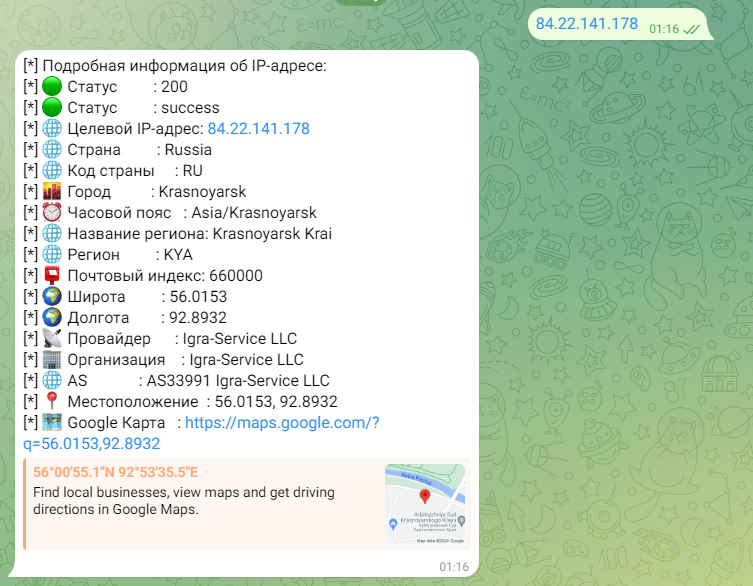
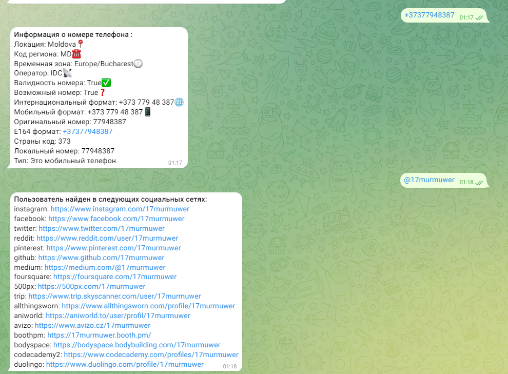

# MurmuwerLeaksBot
 Telegram Bot для Поиска по Утечкам Данных 
Этот проект представляет собой Telegram-бота, который позволяет пользователям искать текст в файлах и получать информацию о телефонных номерах и пользователях в социальных сетях. Бот разработан с использованием библиотеки aiogram для асинхронного взаимодействия с API Telegram. Он также включает функции для работы с файлами и веб-запросами.

Основные функции:
Начало работы:

Команда /start отправляет приветственное сообщение и отображает клавиатуру с кнопками для начала и остановки поиска.
Поиск текста в файлах:

Кнопка 🔍 Начать поиск запрашивает у пользователя текст для поиска.
Бот ищет указанный текст во всех .txt файлах в заданной директории.
Поиск отображает прогресс в виде процентного соотношения и прогресс-бара.
По завершении поиска бот отправляет сообщение с результатами поиска.
Обработка номеров телефонов:

Бот принимает номера телефонов, начинающиеся с +, и возвращает информацию о них, включая локацию, оператора, временные зоны и валидность номера.
Поиск пользователей в социальных сетях:

Бот обрабатывает запросы, содержащие @, и ищет указанные имена пользователей в различных социальных сетях.
Список поддерживаемых социальных сетей включает Instagram, Facebook, Twitter, и многие другие.
Остановка поиска:

Кнопка ⛔ Остановить поиск прерывает текущий процесс поиска.
Технические детали:
Асинхронность:

Для чтения файлов и выполнения веб-запросов используются асинхронные функции (aiofiles и aiohttp).
Это позволяет эффективно обрабатывать большое количество файлов и веб-запросов без блокировки основного потока.
Логирование:

Все поисковые запросы пользователей логируются с указанием времени и имени пользователя.
Клавиатура:

Клавиатура с кнопками 🔍 Начать поиск и ⛔ Остановить поиск всегда видна пользователю, обеспечивая удобный доступ к основным функциям бота.
Этот бот может быть полезен для организаций и пользователей, которые хотят быстро находить информацию в больших наборах текстовых данных или проверять телефонные номера и профили в социальных сетях.
